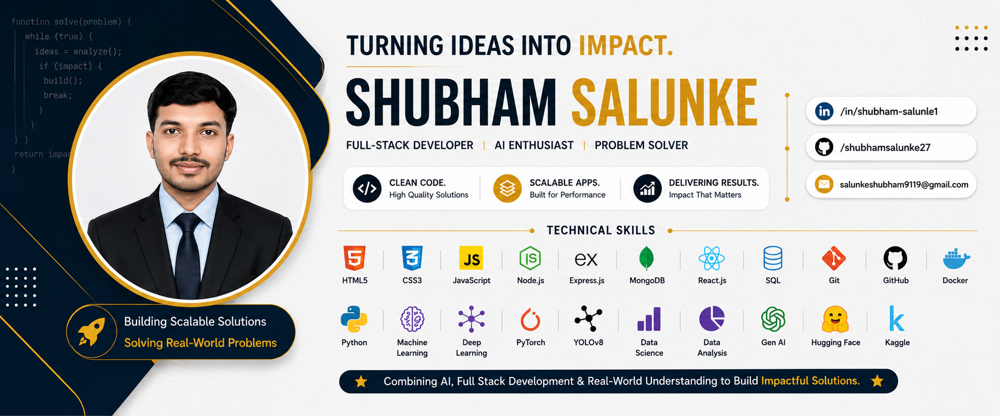

  

---

# 👋 Hey, I'm Shubham Salunke

  

---
🚀 Computer Engineering student passionate about building **real-world AI systems**, scalable full-stack applications, and technology-driven solutions with practical impact.

My work focuses on combining:

- 🤖 Artificial Intelligence
- 🌐 Full Stack Development
- 📡 IoT & Smart Systems
- ⚙️ Scalable System Design
- 🧠 Real-World Problem Solving

to create intelligent systems that solve operational and industry-level challenges.

> **“Real impact starts with understanding real problems.”**

---

## 🥛 Founder @ DudhAmrut

### AI + IoT DairyTech Initiative

DudhAmrut is a DairyTech initiative focused on improving:

- Milk Quality Awareness
- Dairy Traceability
- Supply Chain Transparency
- AI-driven Dairy Intelligence

through AI, IoT, and scalable technologies.

The initiative was shaped through:
- 🌾 Farmer interactions
- 🥛 Dairy ecosystem exposure
- 🚚 Collection center workflows
- 📦 Ground-level operational understanding

rather than only theoretical assumptions.

🔗 **Organization:**  
https://github.com/DudhAmrut

---

## ⚡ Tech Stack

  

---

# 🚀 Featured Projects

## 🫁 CliniScan AI

> End-to-end Medical AI platform for lung abnormality detection using Deep Learning, YOLOv8 & Explainable AI.

⚡ **PyTorch • YOLOv8 • FastAPI • Docker • Grad-CAM**

🔗 Repository:  
https://github.com/shubhamsalunke27/CliniScanAI-Lung-Abnormality-Detection

---

## 📩 MailMind.ai

> Enterprise AI environment for intelligent email triage, SLA-aware routing, escalation workflows, and AI-driven decision systems.

⚡ **LLMs • FastAPI • Docker • OpenEnv**

🔗 Repository:  
https://github.com/shubhamsalunke27/MailMind.ai-OpenEnv-Enterprise-Email-Triage

---

## 🥛 DudhAmrut

> AI + IoT DairyTech ecosystem focused on traceability, transparency, and intelligent dairy workflows.

⚡ **AI • IoT • Full Stack • DairyTech**

🔗 Organization:  
https://github.com/DudhAmrut

---

## 🌌 SDSS Galaxy Classification

> Machine Learning system for automated galaxy classification using SDSS astronomical datasets.

⚡ **Python • Scikit-learn • Pandas • NumPy**

🔗 Repository:  
https://github.com/shubhamsalunke27/SDSS-Galaxy-Classification-Using-ML

---

## 💼 Freelancing MERN Platform

> Full-stack freelancing application with authentication, job workflows, and scalable MERN architecture.

⚡ **MongoDB • Express.js • React.js • Node.js**

🔗 Repository:  
https://github.com/shubhamsalunke27/Freelancing-application-mern

---

## 🎓 Student Support System

> Centralized academic support and complaint management platform for improving student-authority interaction.

⚡ **Python • Flask • SQLite**

🔗 Repository:  
https://github.com/shubhamsalunke27/Student-Support-System

---

# 🏢 Experience

## 🔹 AI Intern — Infosys Springboard
### *(Feb 2026 – Apr 2026)*

Worked on:
- Medical AI systems
- Deep Learning workflows
- Explainable AI integration
- Production-oriented deployment
- AI product engineering

🧠 Project: **CliniScan AI**

---

## 🔹 Full Stack Development Intern — Cognifyz Technologies

Worked on:
- Full-stack application development
- Backend workflows
- Software engineering concepts

---

## 🔹 Full Stack Developer Intern — SmartBridge

Focused on:
- MERN Stack Development
- Frontend & backend integration
- Deployment workflows

---

## 🔹 Machine Learning Engineer Intern — SmartBridge

Worked on:
- Machine Learning workflows
- AI model implementation
- Practical ML systems

---

# 🏆 Achievements

🏆 1st Rank — Createchnova Innovation Competition  

🏆 Zonal Winner & University Finalist — Avishkar Research Competition (SPPU)  

🏆 Finalist — Arambh National Entrepreneurship Competition  

🎓 Cummins India Foundation Scholar  

🥛 Presented DudhAmrut at Center of Excellence in Dairy, Baramati  

🎤 Head Coordinator — National Level AI Event: Createchnova AI Future Frame

---

# 📜 Certifications

- Aspire Leaders Program Graduate — Aspire Institute
- Principles of Generative AI — Infosys Springboard
- Artificial Intelligence Primer — Infosys Springboard
- Machine Learning Crash Course — Google
- Startup School: Prompt to Prototype — Google for Startups
- IBM SkillsBuild — Getting Started with Artificial Intelligence

---

# 🌱 Vision

I believe technology should not only be innovative — it should be:

- Practical
- Scalable
- Intelligent
- User-Centric
- Impact-Driven

Focused on building systems that create meaningful real-world impact through engineering and intelligent design.

---

# 🚀 Currently Exploring

- Agentic AI Systems
- AI Product Engineering
- AI + IoT Integration
- Full Stack System Architecture
- Real-Time AI Inference
- Enterprise AI Workflows

---

# 🤝 Open To

✅ AI / ML Opportunities  
✅ Full Stack Development Roles  
✅ Open Source Collaboration  
✅ Startup & Product Development  
✅ AI Research & Engineering  
✅ DairyTech / AgriTech Ecosystems

---

## 🌐 Connect With Me

  

📧 **Email:** salunkeshubham9119@gmail.com

---

# 🚀 Turning Ideas Into Scalable Intelligent Systems

### AI • Full Stack • DairyTech • Medical AI • System Design

⭐ *“Innovation becomes meaningful when it solves real-world problems.”*

